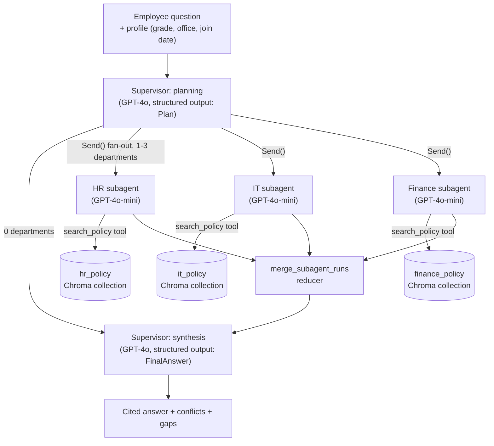

# Kestrel Subagentic RAG Assistant

A chat assistant that answers Kestrel Systems employee questions from three policy PDFs (HR, IT,
Finance). A supervisor agent plans which department(s) a question needs, narrow specialist
subagents search only their own document in parallel, and the supervisor combines their findings
into one cited answer — catching and resolving conflicts between documents along the way.

Built against the *Subagentic RAG Assistant* project assignment, using
`Kestrel_HR_Policy_Handbook_v4_1.pdf`, `Kestrel_IT_Services_and_Security_Policy_v2_3.pdf`, and
`Kestrel_Travel_Expense_and_Relocation_Policy_v3_0.pdf` as the knowledge base.

## Testing

This repo includes a 27-test suite that runs completely offline — no OpenAI key, no network calls
(`pytest`). It covers:

- the clause-level PDF splitter, run against the actual policy text (exact clause counts verified,
  zero header/footer leakage, every one of the ~34/32/32 clauses present with no gaps or
  duplicates);
- the Chroma ingestion/upsert logic (idempotent re-ingestion, department isolation);
- the LangGraph workflow's *wiring*: parallel fan-out to the right departments, the reducer that
  merges parallel subagent results, the empty-plan short-circuit, a disabled-department path, and
  a **real thread-level timeout** (tested by making a fake subagent sleep past the budget and
  confirming the graph doesn't wait for it);
- the conflict-detection heuristic, proven to catch the HR-4.4 / Finance-6.4 accommodation-nights
  conflict and *not* false-positive on an unrelated finding.

These tests run against `tests/fake_chat_model.py` and `tests/fake_embeddings.py` — deterministic
stand-ins for the real OpenAI calls — so the workflow's structure (routing, fan-out, timeouts,
conflict detection) is verified independently of model quality, and the suite runs in a couple of
seconds with nothing to configure. They intentionally do **not** test answer quality, since the
fakes do keyword matching, not reasoning. **Run `eval/run_eval.py --mode real` with your own
OpenAI key to get real accuracy numbers** for Phase 9 — see "Evaluating" below.

## Setup

```bash
python -m venv .venv
source .venv/bin/activate          # Windows: .venv\Scripts\activate
pip install -r requirements.txt

cp .env.example .env               # then edit .env and add your OPENAI_API_KEY
```

Place your three original PDF files in `data/`, using the exact filenames `ingest/doc_config.py`
expects:

- `Kestrel_HR_Policy_Handbook_v4_1.pdf`
- `Kestrel_IT_Services_and_Security_Policy_v2_3.pdf`
- `Kestrel_Travel_Expense_and_Relocation_Policy_v3_0.pdf`

If a PDF is missing, `ingest/clean.py` automatically falls back to the plain-text fixtures in
`data/raw/` (transcribed verbatim from the same three documents), so the pipeline and test suite
still run end-to-end without them. Once the real PDFs are in place, `ingest/clean.py` uses them
`ingest/clean.py` uses them instead automatically — no config change needed.

```bash
python -m ingest.build_collections   # one-time: embeds all chunks into chroma_db/ (~$0.001, tiny)
streamlit run app/streamlit_app.py
```

Run the tests any time (no key needed):

```bash
pytest -v
```

## Evaluating

```bash
# Subagent design against the 16-question acceptance test set:
python -m eval.run_eval --mode real

# Single-agent baseline (Phase 10) for comparison:
python -m eval.run_baseline_eval --mode real

# Auto-generate the two Phase 10 submission deliverables from the two CSVs above --
# one combined evaluation sheet (both designs, one file) and a one-page comparison
# report with the summary table, the two most-different questions, and a draft
# conclusion filled in from your real numbers:
python -m eval.generate_comparison_report
```

Both write a CSV to `eval/results/` with per-question routing, keypoint coverage, citation
grounding, conflict handling, time, and tokens, plus a printed summary. The keypoint-coverage
check is a **best-effort substring match** — the assignment itself notes wording can differ, so
review the `missed_keypoints` and `answer` columns yourself and use the blank `manual_override`
column to correct any case where the automatic check was too literal. Citation grounding, by
contrast, is a hard automated check: every `[DOC-ID, section N]` in the answer must trace back to
a real finding a subagent reported, which catches hallucinated citations.

`--mode fake` re-runs the same harness against the offline fake models, purely to prove the
harness itself doesn't crash and writes a well-formed sheet — the numbers it produces are not
meaningful (see the note it prints). `generate_comparison_report.py` refuses to let this go
unnoticed: run it with `--mode-label fake` and the resulting report opens with a bold warning
that it wasn't built from real model output.

## Submission checklist

| Deliverable | Where |
|---|---|
| GitHub repository | this whole directory |
| README | this file — setup, architecture diagram, design decisions, reflections |
| Demo video (3-5 min) | record it following `docs/demo_script.md` — a full shot list and talking-point script for questions 2, 9, 12, 16 |
| Evaluation sheet, both designs | run the three commands above; `eval/results/combined_evaluation_sheet_<ts>.csv` has all 16 questions × both designs in one file |
| One-page comparison report | `eval/results/comparison_report_<ts>.md`, auto-generated from your real CSVs with the summary table, the two questions where the designs differ most, and a draft conclusion to review before submitting |

## Architecture



Each subagent (`subagents/hr.py`, `it.py`, `finance.py`) is built the same way
(`subagents/base.py`): narrow instructions, one search tool scoped to its own Chroma collection,
and a two-step "gather then structure" execution — a bounded tool-calling loop gathers real
retrieved clauses, then a single `with_structured_output(SubagentResult)` call turns *only those
retrieved clauses* into the fixed schema. This is deliberate: a finding cannot exist in the output
without a real section/page/version behind it, because the structuring call never sees anything
else.

## Design decisions

**Chunking (Phase 1).** Chunks are split on the clause pattern `N.M ` at the start of a line, never
on a fixed character count — a table under a clause (e.g. the leave-entitlements table under HR
3.1) is absorbed into that clause's chunk automatically, since nothing about a table row matches
the clause pattern. The running header/footer (`"Kestrel Systems Pvt. Ltd. <title> vX.X"` /
`"<DOC-ID> | Effective <date> | Internal Page N"`) is stripped by regex, and — cleverly reused —
the page number embedded in that same header is the ground truth for every line that follows it,
which is more reliable than trusting `pypdf`'s own page boundaries.

**Top-k.** 4 chunks per search call, matching the assignment's own test-search expectations
("expected section in the top 3"). Subagents can re-search up to 3 rounds with different wording.

**Models.** GPT-4o for the supervisor (planning needs to reason about which of three overlapping
department descriptions actually cover a question; synthesis needs to catch and resolve
conflicts) and GPT-4o-mini for the three subagents (a narrow "read these 4 chunks and report what
you found" task doesn't need the larger model). `text-embedding-3-small` for everything, per the
assignment.

**Conflict rules.** Applied in the order the assignment specifies (an explicit-supersession clause
wins > Finance prevails on financial benefits > newer effective date wins > show both and say
"confirm with HR"). Conflict *candidates* are found by a cheap keyword-overlap pass across
findings from different departments (`supervisor/synthesis.py::find_topic_overlaps`) before the
synthesis model ever sees them — this is a deliberate belt-and-suspenders layer, because leaving
conflict-spotting entirely to the model's judgement is exactly the pilot's original failure mode.

**Reliability nets on top of the LLM, not instead of it.** Two places in the supervisor's planning
step don't fully trust the model to remember instructions: every task message is deterministically
prefixed with the employee's profile (grade/office/join date), and a Finance task gets a
deterministic metro/non-metro note appended when the question names a known city. The model still
does the actual planning and writing; these are just safety nets against the exact "missing parts"
failure the assignment's pilot suffered.

**Chroma client sharing gotcha.** `langchain_chroma.Chroma(persist_directory=...)` builds its own
internal client keyed by a fixed `"ephemeral"` identifier per process in the pinned version here —
constructing it twice with different settings in the same process raises "instance already exists
with different settings." We sidestep this by building our own `chromadb.PersistentClient` once
(`ingest/build_collections.get_client`) and passing it explicitly via `Chroma(client=...)`
everywhere. Worth knowing if you see that error while extending this.

## Stretch goal implemented: relocation-checklist skill

`skills/relocation-checklist/SKILL.md` + `supervisor/skills.py`. When the question is
relocation-related (keyword-detected), its formatting instructions are appended to the synthesis
prompt, asking for a dated, phased checklist instead of a flat paragraph. Tested in
`tests/test_skills.py`.

Not implemented (left as ideas, per the assignment's "optional, up to 10 bonus marks" framing):
human-in-the-loop conflict review, the router-only comparison, parallel voting on money answers,
and the handoff-to-human path.

## Reflection questions

**1. Which question showed the biggest difference between the subagent design and the baseline?**
Expect it to be Q12 (the full relocation question) or Q14 (temporary accommodation nights): the
baseline's single search call over one combined collection has no structural reason to retrieve
*both* the HR and Finance accommodation clauses in the same top-4, and even if it does, nothing
forces it to notice they disagree — that's precisely the "outdated rule" failure the assignment's
pilot describes. The subagent design guarantees both documents are searched (the supervisor's plan
routes to both), so the conflict is visible to synthesis by construction. Confirm this against your
own `--mode real` CSVs rather than taking this as given.

**2. What does the subagent design cost on single-department questions?** Structurally: one extra
model call (the planning step) and the token overhead of GPT-4o reasoning about routing, versus
the baseline's single agent going straight to search. Q1-Q7 (single-department) are where you'd
expect the baseline's token/time numbers to look competitive or better — check your real-mode CSVs
for the actual delta.

**3. Where might the supervisor choose the wrong departments?** The likeliest failure mode is a
question that uses language closer to one department's *literal* words than to the underlying
topic (e.g. "working from Goa" needing HR's hybrid-work section without saying "hybrid"). The
planner's system prompt describes each department by topic, not keyword, specifically to reduce
this — but only real GPT-4o runs can tell you if it worked. Fix path: read `plan_reason` in a
failing case and sharpen the department descriptions.

**4. Would a router (pick exactly one department) have been enough for Kestrel?** No — by
construction. Six of the sixteen test questions (Q8-Q12, Q14) need two or three departments in one
answer, because Kestrel's own document ownership deliberately splits related topics: relocation
*leave* is HR, relocation *money* is Finance, relocation *equipment* is IT. A router can serve the
other ten questions fine, but would silently drop parts of every multi-department question,
reproducing the pilot's "missing parts" failure.

**5. If a fourth department (Legal) were added?** `ingest/doc_config.py` gains an entry;
`subagents/legal.py` is a copy of `hr.py`'s shape with Legal-specific instructions;
`graph/workflow.py`'s `_BUILDERS` dict gains a `"legal"` key (the `Send`-based fan-out already
generalizes to N departments with no other change); the planner's system prompt gains a
description of what Legal covers; and `supervisor/synthesis.py`'s conflict-resolution order would
need a new rule for Legal-vs-Finance or Legal-vs-HR precedence, since the current order only
special-cases Finance.

## A note on a harmless log line

You may see `Failed to send telemetry event ...: capture() takes 1 positional argument but 3 were
given` in the logs. This is a known Chroma/PostHog version-mismatch in their anonymous telemetry
client — cosmetic, and unrelated to anything in this codebase; it does not affect ingestion,
search, or any test result.

## Project layout

```
data/            the three policy PDFs, and raw/ (offline text fixtures used by the test suite)
ingest/          Phase 1-2: PDF cleaning/clause-splitting, Chroma collection builder
subagents/       Phase 3-4: the shared subagent builder + HR/IT/Finance instructions
supervisor/      Phase 5, 7, stretch: planning, synthesis + conflict rules, skill loader
graph/           Phase 6: the LangGraph workflow (state, parallel fan-out, timeout)
app/             Phase 8: the Streamlit chat UI
eval/            Phase 9-10: the 16-question test set, subagent eval runner, baseline + its runner,
                 and generate_comparison_report.py for the two Phase 10 submission deliverables
skills/          the relocation-checklist stretch-goal skill
docs/            demo_script.md — shot list for the required submission video
tests/           27 offline tests (fake embeddings + a scripted fake chat model) covering every
                 phase above with no API key required
```
